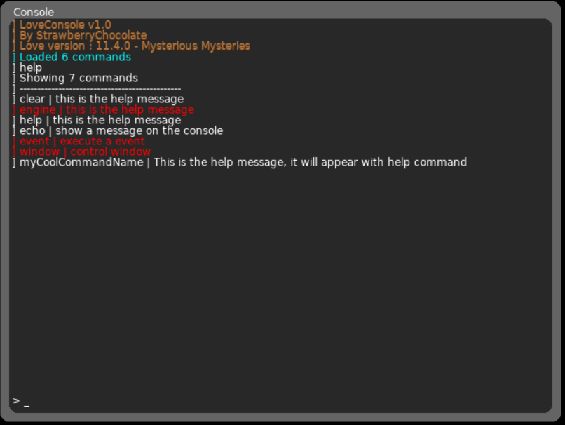
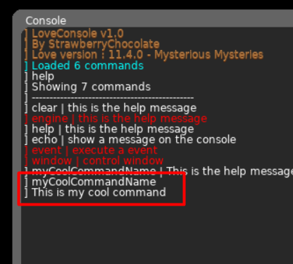
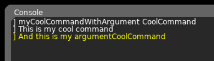

# LoveConsole

A simple to use and powerful command Console to your love games.

---

## Features

- Draggable window
- Custom command support (supporting commands with parameters, without changing the source)
- Simple color support
- Easy to install and setup.
- No need external files to work.
- Window resizing and auto breaking text

### Planned:

- [ ] More default commands

---

## How to install

> ### **[1] -** Copy the console library to your project folder

> ### **[2] -** require it with `console = require 'console'`

> ### **[3] -** Put every function on specific callback. Example : console:update(dt) to to love.update(dt) callback.

---

## Examples of use

### **[Example 1] |** using with [hump gamestate](https://github.com/vrld/hump/tree/master)

Instead of calling every function of the console library in every state you create, this example shows you how to create a global console.

```lua
function love.load()
    -- require the console library --
    console = require 'console'
    gamestate = require 'gamestate'

    -- create a new console at x: 90, y: 90
    console:init()

    -- states list (cool for organization :D) --
    states = {
        myState = require 'states.mystate'
    }
    
    -- register the necessary events --
    gamestate.registerEvents({'update', 'textinput', 'keypressed', 'mousepressed', 'mousereleased'})
    -- change the state --
    gamestate.switch(states.myState)
end

function love.draw()
    -- draw all the state stuff first --
    gamestate.current():draw()
    -- after drawing the state stuff, draw the console itself --
    console:render()
end

function love.update(elapsed)
    console:update()
end

function love.textinput(text)
    console:textinput(text)
end

function love.keypressed(k)
    console:keypressed(k)
end

function love.mousepressed(x, y, button)
    console:mousepressed(x, y, button)
end

function love.mousereleased(x, y, button)
    console:mousereleased(x, y, button)
end
```

> **OBS:** This method don't work for `love.graphics.present()` function. Everything draw on the present() method will appear on the top

> **OBS 2:** This example shows you how to setup the console globally, removing the need to install it on every state you create and want use.

---

### **[Example 2] |** creating custom commands (Part 1 - The basic command)

This example will show you how to create a basic command *without any arguments*. It uses a function called `console:registerCommand:(<commandName>:string, <helpDescription>:string, <commandFunction>:function)`

> **OBS :** This example also uses another command, the `console:trace()` command, it will be explained on the functions section.

```lua
function love.load()
    -- require the console library --
    console = require 'console'
    -- create a new console at x: 90, y: 90
    console:init()

    console:registerCommand("myCoolCommandName", "This is the help message, it will appear with help command" function()
        console:trace("This is my cool command")
    end)
end
```

and this is the result : 



and when we run the command on the console:



### **[Example 3] |** creating custom commands (Part 2 - Commands with arguments)

Is the same process to create commands but this time, we include the arguments we want as parameters on the function

```lua
function love.load()
    -- require the console library --
    console = require 'console'
    -- create a new console at x: 90, y: 90
    console:init()

    console:registerCommand("myCoolCommandWithArgument", "This is the help message, it will appear with help command", 0, function(argument)
        console:trace("This is my cool command")
        console:trace("And this is my argument" .. argument)
    end)
end
```

and this is the result when we execute it on the console :



## Function list

---

### **console:registerCommand()**

---

Used to register a custom command to commands database.

Usage : `console:registerCommands(<commandName>, <helpDescription>, <priorityLevel>, <functionExec>)`

| Parameters  | Type | optional | Description |
| ------------- | ------------- | ------------- | ------------- |
| commandName | `string` | no | The name of your command |
| helpDescription | `string` | yes  | The description of your command |
| priorityLevel | `number` | yes | Define the priority color on the `help` command|
| functionExec | `function` | no | The lua function you want run when the command is executed|

---

### **console:rebind()**

---

Used to rebind some keyboard keys functions

Usage : `console:rebind(<keys>)`

| Parameters  | Type | optional | Description |
| ------------- | ------------- | ------------- | ------------- |
| keys | `table` | no | The keys table you want rebind |

here the list of the possible values to use in this table:

| Keys | value |
| ---- | ----- |
| submit | return |
| open | f1 |
| removeChar | backspace |
| previousCommand | up |
| nextcommand | down |

example :

```lua
console:rebind({
    submit = "return",
    open = "f1",
    removeChar = "backspace",
    previousCommand = "up"
    nextcommand = "down"
})
```

> **OBS :** Please insert a valid key constant, if you want check the official [LOVE keys Constant reference](https://love2d.org/wiki/KeyConstant)

---

### **console:trace()**

---

Used to write a message on the console display.

Usage: `console:trace(<message>, <level>)`

| Parameters  | Type | optional | Description |
| ------------- | ------------- | ------------- | ------------- |
| message | `string` | no | The message you want write |

---

### **console:setTheme()**

---

Used to change the colors of the console including  the text colors

Usage : `console:setTheme(_theme)`

| Parameters  | Type | optional | Description |
| ------------- | ------------- | ------------- | ------------- |
| theme | `table` | no | The theme data table |

here the list of the possible values to use in this table:

| Key | value |
| ---- | ----- |
| bg | table of colors (0 - 255) |
| fg | table of colors (0 - 255) |
| textColor | table of colors (0 - 255) |


**Example** :
```lua
function love.load()
    loveconsole:setTheme({
        bg = {255, 255, 255},
        fg = {128, 128, 128},
        textColor = {
            {255, 255, 255},
            {128, 128, 128},
            {0, 0, 0}
        }
    })
end
```